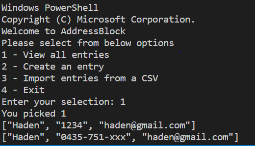
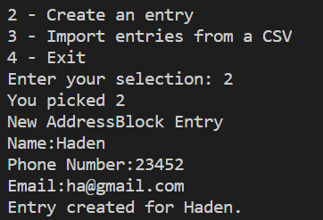
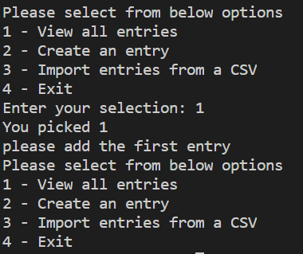
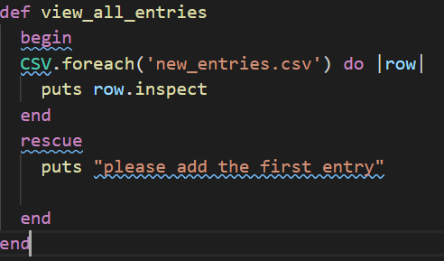
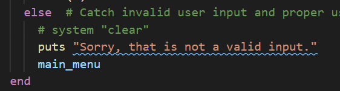
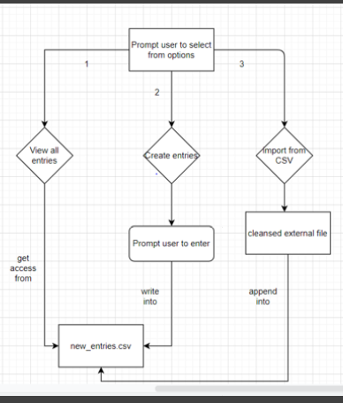

# Terminal Application - Contact Book

## Link of Git Repo
The project can be founded via the link: https://github.com/haden-liu/T1A3

## Software Development Plan

## Develop a statement of purpose and scope for your application. It must include:
- describe at a high level what the application will do.

The application can be used as either a independent application which allow business users to upload contact details or integrated with other applications to play as an uploading and storing app for business contact.

- identify the problem it will solve and explain why you are developing it

In the real world, many organisations are encountering with large number of customer data. They need web or terminal based app to upload, store and modify the customer data, and use the data for future analysis. 

So I want to develop an application to support these demands, to support efficient customer data and information management.

- identify the target audience

    1. business professionals
    2. Management team
    3. IT & Analytics team

- explain how a member of the target audience will use it

Business users can add the customer details to the automatically generated csv file.

Business users can add a large number of records to the application with csv file import method.

In future, IT & Analytics team can get access the records and do business analysis.

## Develop a list of features that will be included in the application. It must include:
- at least THREE features
  1.  Add single customer detail record
  2.  Import large number of records with CSV
  3.  View current records
- describe each feature
    1. users will enter their customer name, mobile number and email address as per application prompts. After the record be collected, it will be written into the generated csv file.
    2. User will save the csv file which contains contact records to the application folder. The csv file must have the records have the same format with records in application csv file.  Then user will enter the name of csv file they want to save into the application. The records of the new csv file will be read and append into the application csv file. 
    3. The application can display records currently be saved in the application csv file.

## Develop an outline of the user interaction and experience for the application.

- how the user will find out how to interact with / use each feature
    1. The main menu method will display the main service options of application. And the user will be asked to select with the ordering number.
    2. The first feature will show the current saved customer contact records from the csv file using the looping method.
    
    3. The second feature prompts users to add the single customer contact records to the csv file.
    
    4.  The third feature allows user to firstly save to csv file to the application folder, and typing the file name to append the customer contact records to the application csv file.
    

- how errors will be handled by the application and displayed to the user.
    1. For first time users to the application, the application will displays the error to ask them to create the first entry before to view the entries.
    
    

    2. The application also using the control flow to validate selections by users.
    

## Develop a diagram which describes the control flow of your application. Your diagram must:
- show the workflow/logic and/or integration of the features in your application for each feature.
- utilise a recognised format or set of conventions for a control flow diagram, such as UML.

## Develop an implementation plan which:
- outlines how each feature will be implemented and a checklist of tasks for each feature
- prioritise the implementation of different features, or checklist items within a feature
- provide a deadline, duration or other time indicator for each feature or checklist/checklist-item

Utilise a suitable project management platform to track this implementation plan

> Your checklists for each feature should have at least 5 items.

Feature 1 checklist:
1. Import CSV package to utilise further features
2. Create MenuController class to hold the methods of features
3. Create main_menu method to prompt user selection
4. Create error handling to display error message
5. Create view_all_entries method to read the data records

Feature 2 checklist:
1. create create_entry method in the menu_controller to prompt user to create entry
2. create addressBook class to control csv file.
3. initialize the addressBook class to the menuController.
4. create add_entry method to add new entries to csv file.
5. add created methods to the main_menu method looping to run the app.

Feature 3 checklist:
1. create read_csv metod under the menu_controller to validate the file name input and display message
2. under the addressBook class, create import_from_csv method to read the csv file and append the records to the application through looping.

## Design help documentation which includes a set of instructions which accurately describe how to use and install the application.

steps to install the application:

1. Please install ruby refer to [this link](https://www.ruby-lang.org/en/downloads/)
2. Next please install Bundler gem with following command:
`gem install bundler`
3. Please install csv package
`gem install csv`
4. Run the app
`ruby index.rb`

